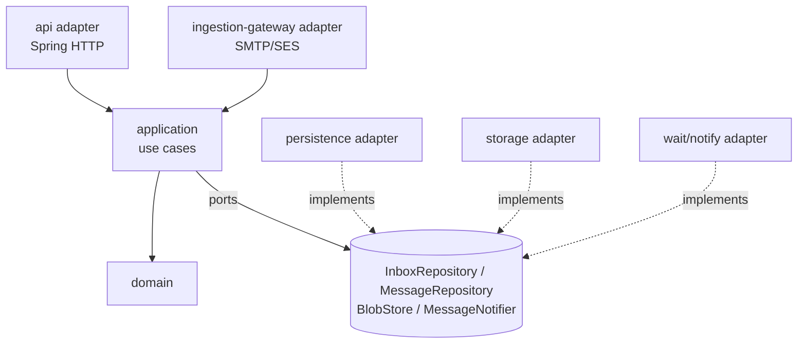

# ADR-024: Application Layer and Dependency Rule

**Status:** Accepted (amends [ADR-001](0001-architecture-style.md) and
[ADR-002](0002-domain-boundaries.md); corrects the module diagram in
`docs/architecture/component-architecture.md`)

## Context

The previous component diagram had two structural problems:

1. It drew `domain → persistence` and `domain → storage`, while
   simultaneously requiring (ArchUnit rule, quality strategy) that
   `domain` be framework-free with no JPA/provider dependencies. As
   drawn, the dependency direction contradicted the stated constraint.
2. The independently deployed `ingestion-gateway` wrote to persistence
   and object storage **directly**, bypassing whatever layer the API uses.
   The business invariants that make ingestion correct — active-inbox
   resolution, the `Expiring` grace window, provider-event deduplication
   (ADR-019), and the visibility+notify atomicity invariant (ADR-020) —
   would then exist either duplicated in two code paths or only in the
   gateway, where the API can't reuse them. Duplicated invariants drift;
   drifted invariants are exactly how the near-expiry and lost-wake-up
   races come back after being designed away.

## Decision

Adopt a pragmatic ports-and-adapters dependency model:

- **domain**: entities and pure domain logic. Depends on nothing.
- **application**: use cases — `CreateInbox`, `ReserveExactAddress`
  (ADR-021), `ReceiveInboundDelivery`, `WaitForMessage`, `ExpireInboxes` —
  and the **port interfaces** they need (`InboxRepository`,
  `MessageRepository`, `BlobStore`, `MessageNotifier`, `Clock`). All
  invariant-bearing writes live here, once.
- **api** and **ingestion-gateway** are *adapters* invoking the same
  application use cases. The gateway remains an independently deployable
  process (ADR-001 unchanged — the isolation argument is about network
  exposure and blast radius, not about owning a private write path): it
  embeds `application` + `domain` + the infrastructure adapters as
  libraries. No internal HTTP hop is introduced.
- **persistence**, **storage**, and the notify mechanism are
  infrastructure adapters implementing the ports.

Pragmatism boundaries (what this ADR does **not** introduce): no CQRS, no
event sourcing, no per-entity port explosion, no mandatory use-case
ceremony for trivial reads — simple queries (e.g., `GET /messages/{id}`)
may go through thin query services against the same ports. The rule that
matters: **any write that must uphold a documented invariant goes through
exactly one application use case**, and ArchUnit enforces the dependency
directions (`domain` depends on nothing; `application` depends only on
`domain`; adapters depend inward).

## Alternatives considered

- **Status quo (both entry points write via persistence directly)**:
  rejected — duplicates lifecycle/dedup/visibility invariants across two
  deployables with independent release cadence.
- **Gateway calls the API over an internal HTTP interface**: rejected —
  adds a hop, a failure mode, and an availability coupling that the
  shared-library approach avoids; ADR-001 already accepts shared data
  ownership between the two deployables.
- **Full hexagonal ceremony everywhere (ports for every read, mappers per
  layer)**: rejected — cost without corresponding invariant protection.

## Consequences

- `docs/architecture/component-architecture.md` diagram and module list
  are updated (an `application` Gradle module joins the backend build).
- The ArchUnit rules become straightforwardly checkable statements about
  module dependency direction rather than contradicting the diagram.
- Ingestion and API cannot drift on lifecycle semantics: there is one
  `ReceiveInboundDelivery` implementation to test (including the ADR-020
  same-transaction persist+notify), used by every provider adapter.
