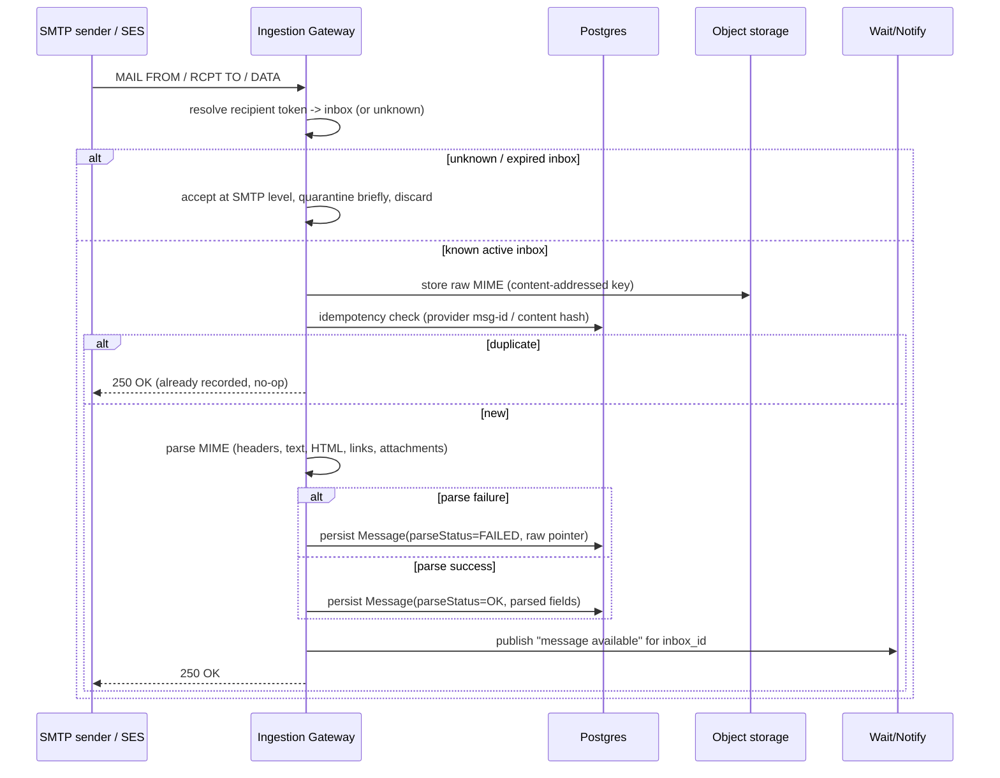

# Inbound Mail Flow

## Step-by-step contract

1. **Acceptance**: the gateway accepts SMTP `RCPT TO` only for syntactically
   valid TestInbox addresses; the *existence* check of the underlying inbox
   happens after `DATA`, not at `RCPT TO`, to avoid leaking which addresses
   are currently reserved via SMTP-level enumeration.
2. **Recipient resolution**: the address token is looked up against active
   inbox reservations. No match (unknown, expired, or already-deleted) →
   message is still accepted (SMTP-level 250) to avoid backscatter/NDN abuse,
   but is discarded after a short quarantine window rather than attributed to
   any inbox. This is a deliberate tradeoff: silently accepting-and-dropping
   avoids TestInbox being used as a bounce oracle, at the cost of not
   surfacing "why didn't my email arrive" directly to the sender (it is
   surfaced via gateway logs/metrics for operators).
3. **Idempotency / deduplication**: SMTP delivery is at-least-once (retries
   from sender MTAs, and SES may redeliver). Deduplication key = provider
   message-id when available, else a hash of (envelope-from, envelope-to,
   raw MIME bytes). A duplicate within the retry window is a no-op, not a
   second `Message` row — this is what makes delivery *effectively-once* as
   observed by the API, even though inbound acceptance itself is
   at-least-once. See [`message-lifecycle.md`](message-lifecycle.md).
4. **Storage before parsing**: raw MIME is written to object storage before
   parsing is attempted, so a parser crash or poison-message never loses the
   original bytes.
5. **Parsing**: MIME → structured `Message` (headers, plaintext, sanitized
   HTML render pointer, extracted links, attachment metadata). See
   [ADR-011](../adr/0011-html-rendering-security.md) for HTML handling and
   [`docs/quality/strategy.md`](../quality/strategy.md) for hostile-MIME test
   coverage. Parse failure never drops the message: it is persisted with
   `parseStatus=FAILED` and the raw MIME remains retrievable via
   `GET /v1/messages/{id}/raw`.
6. **Ordering**: messages are timestamped on receipt and returned in
   receipt order per inbox; cross-connection strict ordering is *not*
   guaranteed (two concurrent SMTP sessions delivering to different inboxes,
   or even the same inbox from different sender MTAs, may interleave).
7. **Notification**: once persisted, a "message available for inbox X" event
   is published for the wait primitive (see
   [`wait-semantics.md`](wait-semantics.md)) — never before persistence, so a
   waiter can never be notified of a message it can't yet read.

## Near-expiration race

If a message arrives while an inbox is mid-expiry (TTL cleanup running
concurrently with inbound delivery): the gateway and cleanup job both operate
transactionally against the inbox row's state (`ACTIVE` → `EXPIRED`). If the
inbox is still `ACTIVE` at the moment the message is persisted, it is
delivered normally even if cleanup runs microseconds later — cleanup only
deletes inboxes with no unprocessed inbound activity in flight (implemented
via a short grace period before hard deletion, not just TTL expiry).
