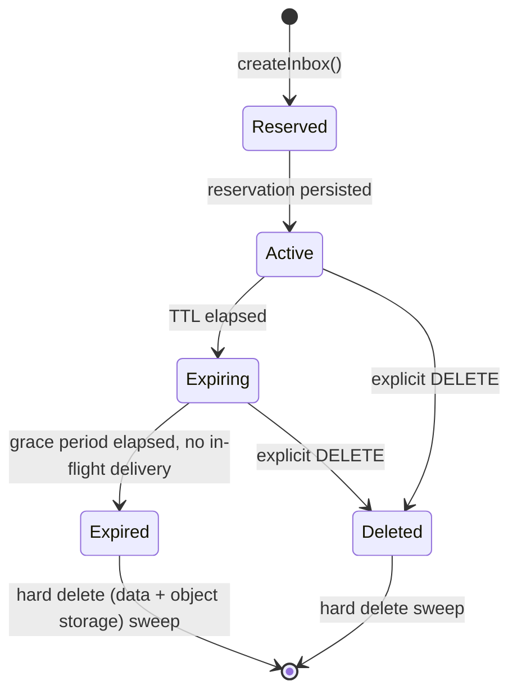
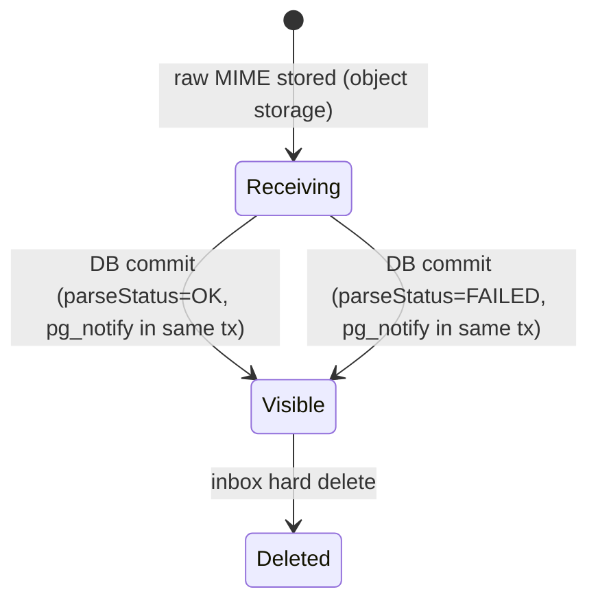

# Message and Inbox Lifecycle

## Inbox states

- **Reserved → Active** is effectively atomic (single DB transaction);
  there is no window where an address is reserved but not yet routable.
- **Expiring**: a short grace window (default proposed: 30s) after TTL
  expiry during which in-flight SMTP deliveries are still honored, to avoid
  dropping a message that started delivery just before expiry. No *new*
  waiters are accepted once `Expiring` begins.
- **Expired/Deleted → hard delete**: a scheduled sweep removes the DB row,
  associated messages/attachments metadata, and issues object-storage
  deletes by prefix. Hard delete is asynchronous but bounded (target: within
  minutes, not immediately, to keep the cleanup job cheap and batchable).
- **Reuse**: a **generated** address token (`GENERATED` mode) is **never**
  reused after expiry/deletion. A new `createInbox()` call always
  allocates a fresh token, even if the requested alias/prefix matches a
  previous inbox. This avoids a subtle class of test flakiness/security
  issue where a new test could receive a straggling message intended for
  a previous test's inbox. **Exact** addresses (`EXACT` mode,
  [ADR-021](../adr/0021-exact-address-reservation.md)) are reusable by
  design after a cooldown window; the straggler-mail residual risk of
  that mode is documented there.

## Message states

- A message becomes **Visible** (queryable via
  `GET /v1/inboxes/{id}/messages` and retrievable via
  `GET /v1/messages/{id}`) at the **commit of the single transaction**
  that inserts its row and issues `pg_notify()` — there is no observable
  state between "committed" and "visible", and no notification can be
  observed before the message is queryable (the atomicity invariant in
  [ADR-020](../adr/0020-wait-reliability-and-timeout-semantics.md)).
  `Receiving` is internal to the ingestion gateway (raw MIME durably
  stored, row not yet committed) and is not API-observable.
- `ParseFailed` messages are visible with raw MIME accessible but without
  parsed fields (from/subject/text/html/links are null/absent), and they do
  **not** satisfy `waitForMessage` matchers that reference parsed fields.
- Delivery, as observed through the API, is **faithful to what was
  accepted**: every completed inbound transaction produces its own
  `Message` row — including genuinely duplicate sends by the system under
  test, which are deliberately *not* collapsed (see
  [ADR-019](../adr/0019-inbound-deduplication-semantics.md)). Only
  reprocessing of the same provider delivery event is a no-op. In the
  rare sender-retry-after-crash window a single send may appear as two
  rows annotated `possibleDuplicateOfMessageId`.
- Deleting an inbox deletes its messages and attachments (cascade); there is
  no independent message retention beyond its parent inbox in MVP.
