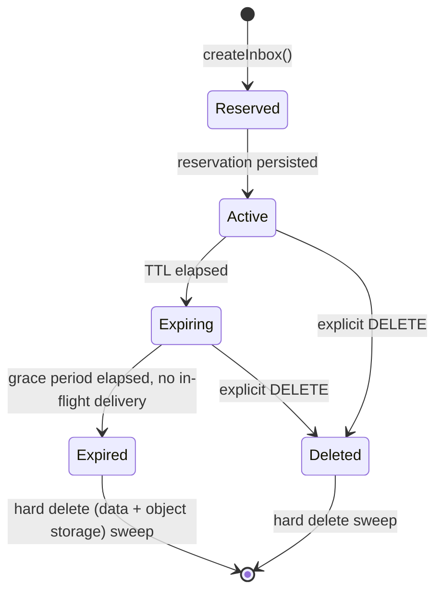
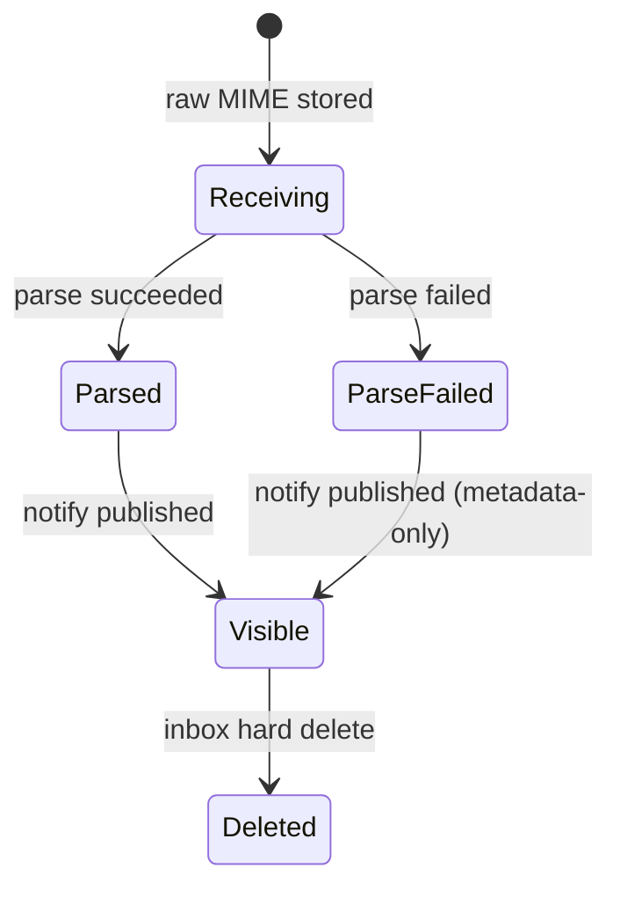

# Message and Inbox Lifecycle

## Inbox states

- **Reserved → Active** is effectively atomic (single DB transaction);
  there is no window where an address is reserved but not yet routable.
- **Expiring**: a short grace window (default proposed: 30s) after TTL
  expiry during which in-flight SMTP deliveries are still honored, to avoid
  dropping a message that started delivery just before expiry. No *new*
  waiters are accepted once `Expiring` begins.
- **Expired/Deleted → hard delete**: a scheduled sweep removes the DB row,
  associated messages/attachments metadata, and issues object-storage
  deletes by prefix. Hard delete is asynchronous but bounded (target: within
  minutes, not immediately, to keep the cleanup job cheap and batchable).
- **Reuse**: an expired/deleted inbox's address token is **never** reused.
  A new `createInbox()` call always allocates a fresh token, even if the
  requested alias/prefix matches a previous inbox. This avoids a subtle class
  of test flakiness/security issue where a new test could receive a
  straggling message intended for a previous test's inbox.

## Message states

- A message is **Visible** (queryable via `GET /v1/inboxes/{id}/messages`
  and retrievable via `GET /v1/messages/{id}`) only once persisted;
  `ParseFailed` messages are visible with raw MIME accessible but without
  parsed fields (from/subject/text/html/links are null/absent), and they do
  **not** satisfy `waitForMessage` matchers that reference parsed fields.
- Delivery, as observed through the API, is **effectively-once**: inbound
  SMTP acceptance is at-least-once, but deduplication at ingestion
  (`inbound-mail-flow.md`) collapses retried/duplicate deliveries into a
  single `Message` row before it ever becomes `Visible`.
- Deleting an inbox deletes its messages and attachments (cascade); there is
  no independent message retention beyond its parent inbox in MVP.
