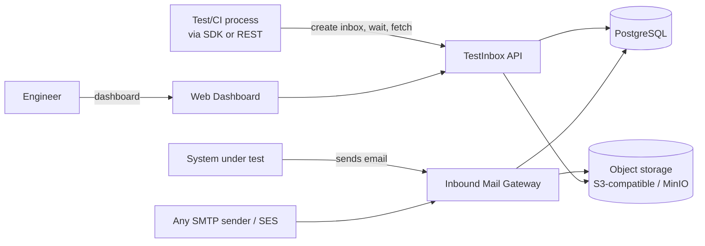

# System Context

## Actors and external systems

## External dependencies

- **Inbound mail source**: whatever SMTP client the system-under-test's mail
  library uses (locally, TestInbox's own SMTP adapter; in production,
  self-hosted Postfix or AWS SES receiving).
- **PostgreSQL**: system of record for domain state (workspaces, inboxes,
  message metadata).
- **S3-compatible object storage**: raw MIME and attachment bytes. MinIO
  locally, any S3-compatible provider in production.
- **Redis (conditional)**: only introduced if a single-node Postgres
  LISTEN/NOTIFY mechanism (ADR-007) stops scaling for wait fan-out or rate
  limiting; not required for MVP.

## What is explicitly out of scope for the system boundary

- TestInbox never initiates outbound email (not a sending/relay service).
- TestInbox never fetches arbitrary remote URLs found in message content.
- TestInbox is not a general-purpose file/object store — object storage is
  used only for raw MIME/attachments tied to a message lifecycle.
