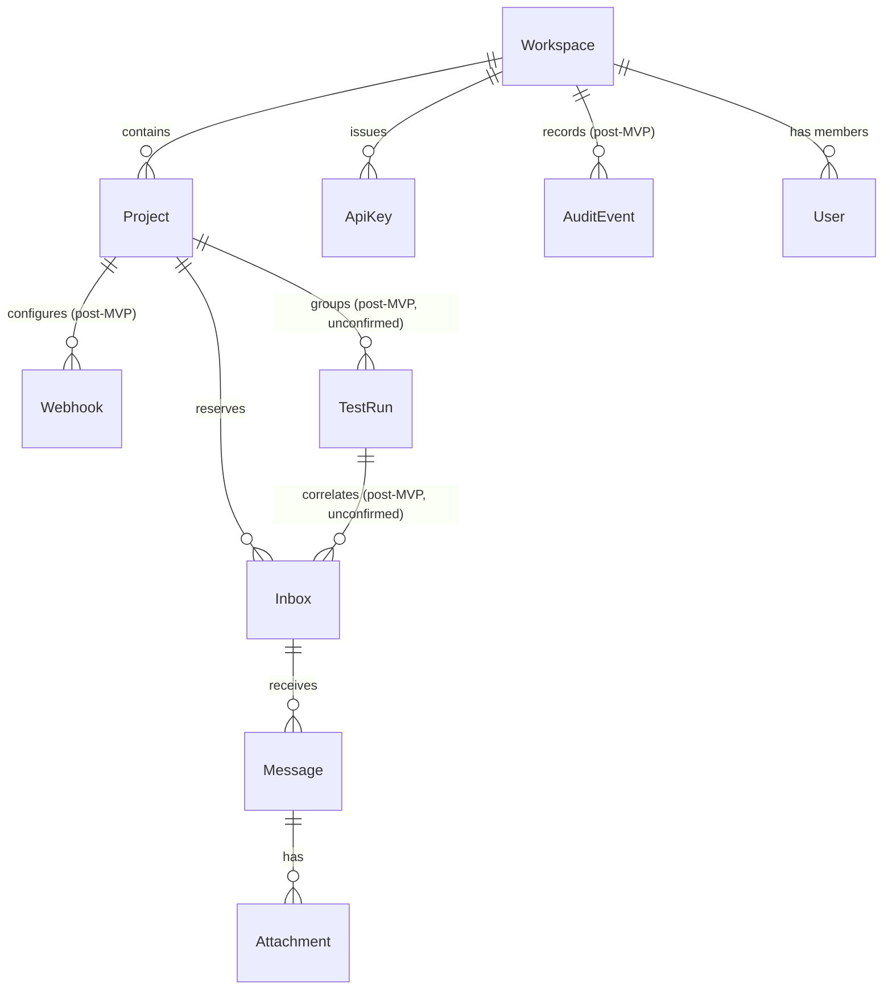

# Domain Model

## MVP-required entities

| Entity | Purpose | Notes |
|---|---|---|
| `User` | Human account for dashboard/administration login. | Minimal: identity + workspace membership; no complex RBAC in MVP. |
| `Workspace` | Tenant boundary; owns projects, API keys, quotas. | All tenant-scoped tables carry `workspace_id`. |
| `Project` | Sub-tenant grouping within a workspace (e.g., per-application). | Namespaces inbox addressing conceptually; does not yet map to a distinct subdomain in MVP. |
| `ApiKey` | Authenticates SDK/REST calls; scoped to a workspace/project. | Opaque token, hashed at rest. See ADR-010. |
| `Inbox` | A reserved logical recipient with an address, TTL, and state. | Not a mailbox in the IMAP sense — see `docs/architecture/message-lifecycle.md`. |
| `Message` | A received, (possibly) parsed email tied to one inbox. | Carries `parseStatus`; raw MIME lives in object storage, not the DB. |
| `Attachment` | A file extracted from a `Message`. | Bytes in object storage; metadata (filename, content-type, size) in Postgres. |

## Deferred entities (not required for MVP)

| Entity | Why deferred |
|---|---|
| `TestRun` | No concrete MVP use case demands cross-inbox correlation; risks being solution-in-search-of-problem. Flagged as a Human Decision Required. |
| `Webhook` | Push notification is an alternative delivery mechanism to `waitForMessage`/polling; not needed to prove the core deterministic-wait value proposition. |
| `AuditEvent` | Needed eventually for security/compliance, but MVP can rely on structured application logs; promote to a first-class entity once multi-user workspaces and compliance requirements are concrete. |

## Explicitly not modeled

No provider-specific concepts (e.g., "SES message ID," "Postfix queue ID")
appear in the domain layer. Provider identifiers are captured only as opaque
metadata on `Message` (e.g., `providerMessageId: String?`) for deduplication,
never as a typed domain concept — see
[ADR-003](../adr/0003-inbound-mail-abstraction.md).
