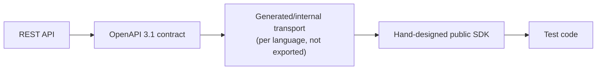

# SDK Architecture

## Layering

- The **OpenAPI 3.1 contract** is the single source of truth for
  request/response shapes: a committed, hand-authored spec that drives
  server-side interface/model generation, both SDK internal transports,
  and CI compatibility checks — it is **not** generated from the Spring
  Boot backend (see [ADR-022](../adr/0022-openapi-contract-first.md)).
- The **generated transport** (e.g., via `openapi-generator` in whatever
  language) lives in an internal, non-exported package/module per SDK
  (`internal.transport` in Kotlin, an unexported `src/internal/` in
  TypeScript). It may be swapped for a hand-written HTTP client later
  without breaking the public API, because nothing public depends on its
  generated types directly.
- The **public SDK** is a thin, hand-designed layer translating between
  ergonomic domain types (`Inbox`, `Message`, matcher DSLs) and the internal
  transport's generated DTOs. This is where retries, rate-limit backoff,
  telemetry hooks, and long-poll chaining for `waitForMessage` live.

## Per-language specifics

### JVM (`testinbox-client`, Kotlin, Java 17 bytecode baseline)

- **Bytecode/API baseline: Java 17** — the backend's Java 25 runtime is a
  deployment choice and does not constrain the public SDK; consumer test
  suites on Java 17, 21, and 25 are all supported and CI-tested (see
  [ADR-023](../adr/0023-sdk-runtime-baselines.md)).
- Written in Kotlin, published with a Java-friendly API (no
  Kotlin-only constructs leaking into the public surface where avoidable —
  e.g., avoid default-parameter-only overloads that are unusable from Java
  without a builder).
- Coroutines (`suspend fun awaitMessage(...)`) for Kotlin callers; a blocking
  facade (e.g., `Inbox.awaitMessageBlocking(...)` or a `Future`-returning
  overload) for plain Java/JUnit5 callers who are not coroutine-aware.
- Distributed via Maven Central under group `email.testinbox`.

### TypeScript/JavaScript (`@testinbox/client`)

- **Minimum supported consumer runtime: Node ≥ 20** (`engines` field);
  built/published on the current active Node LTS in CI, which is a
  toolchain choice invisible to consumers (see
  [ADR-023](../adr/0023-sdk-runtime-baselines.md)).
- Async/await only; no callback-style API.
- Dual ESM/CJS build (needed since Node test runners and bundlers vary in
  module support); type definitions shipped alongside.
- Distributed via npm under scope `@testinbox`.

## What is common vs. per-language

| Concept | Common across SDKs | Per-language detail |
|---|---|---|
| Resource model (`Inbox`, `Message`, matcher vocabulary) | Yes, same concepts/names | Idiomatic syntax (builder vs. fluent object vs. DSL) |
| Long-poll chaining for wait timeout | Yes, same algorithm | Implementation detail (coroutine vs. Promise loop) |
| Error taxonomy | Yes, same categories | Typed exceptions (JVM) vs. typed error classes (TS) |
| Retry/backoff policy for transient failures | Yes, same policy (exponential backoff, capped attempts, only on idempotent/safe operations) | HTTP client used to implement it |
| Telemetry/logging hooks | Yes, same events emitted | Language-native logging integration (SLF4J vs. a pluggable logger interface) |

## Framework integrations

See [`docs/quality/strategy.md`](../quality/strategy.md) and
[ADR-018](../adr/0018-framework-integration-strategy.md). Integrations
(`testinbox-junit5`, `@testinbox/playwright`, etc.) depend on the core SDK
and add framework-specific glue only (e.g., a JUnit 5 extension that creates
an inbox per test and tears it down automatically) — they never duplicate
core SDK logic.
